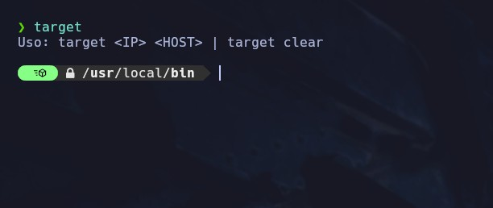
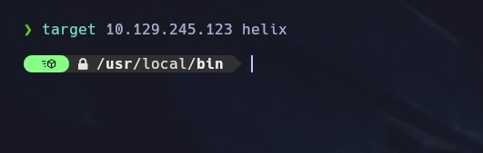
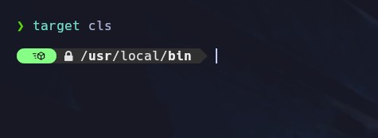
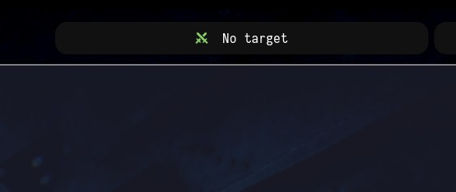

un script en bash para modificar el contenido la la casilla "target" de los entornos con bspwn como al lanzarlo no pide la Ip, host + el clear.

  

entonces añadimos ip + host de ejemplo.

y para limpiarlo, clear o su abreviatura cls.

es totalmente personalizable.
